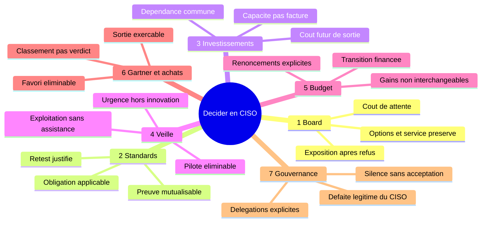
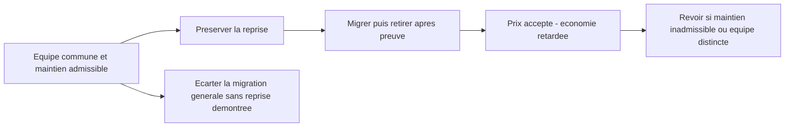

# Sept situations, trois arguments chacune

Carte d’écriture, pas procédure de crise. [Base auteur](base-auteur.md).

```mermaid
mindmap
  root((Decider en CISO))
    1 Board
      Options et service preserve
      Cout de attente
      Exposition apres refus
    2 Standards
      Obligation applicable
      Preuve mutualisable
      Retest justifie
    3 Investissements
      Capacite pas facture
      Cout futur de sortie
      Dependance commune
    4 Veille
      Urgence hors innovation
      Pilote eliminable
      Exploitation sans assistance
    5 Budget
      Transition financee
      Gains non interchangeables
      Renoncements explicites
    6 Gartner et achats
      Classement pas verdict
      Favori eliminable
      Sortie exercable
    7 Gouvernance
      Delegations explicites
      Defaite legitime du CISO
      Silence sans acceptation
```

## Conclusion en une carte

```mermaid
flowchart LR
    A[Equipe commune et maintien admissible] --> B[Preserver la reprise]
    B --> C[Migrer puis retirer apres preuve]
    A --> D[Ecarter la migration generale sans reprise demontree]
    C --> E[Prix accepte - economie retardee]
    E --> F[Revoir si maintien inadmissible ou equipe distincte]
```
